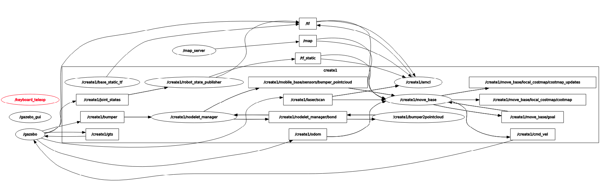
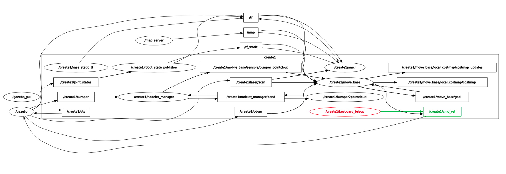

# ROS investigation for Trainee Program, 2nd week

Diverse topics were given for investigating about ROS. We're going to mention them as we move forward in this document.

## Listing namespaces

The first assignment was to list all the namespaces that exist in the current run of ROS. This was made by listing the present nodes after executing the `create_empty_world.launch` simulation and the `keyboard_teleop` tool. Also, additional utilities like `awk` and `uniq` were used for listing namespaces without repetition.
The result was:

```console
create@galatea:/create_ws$ rosnode list | awk -F "/" '{print "/"$2}' | uniq
/create1
/gazebo
/gazebo_gui
/keyboard_teleop
/map_server
/rosout
```

## Listing topics and their message types

The second was to list topics with their message types. The command executed shows both the message types for published topics and subscribed topics.

```console
create@galatea:/create_ws$ rostopic list -v

Published topics:
/map_metadata [nav_msgs/MapMetaData]
/create1/move_base/DWAPlannerROS/parameter_descriptions [dynamic_reconfigure/ConfigDescription]
/create1/move_base/local_costmap/obstacle_layer/parameter_descriptions [dynamic_reconfigure/ConfigDescription]
/create1/amcl/parameter_descriptions [dynamic_reconfigure/ConfigDescription]
/create1/front_right_cliff_sensor/scan [sensor_msgs/LaserScan]
/create1/move_base/result [move_base_msgs/MoveBaseActionResult]
/create1/odom [nav_msgs/Odometry]
/tf [tf2_msgs/TFMessage] 4 publishers
/clicked_point [geometry_msgs/PointStamped]
/create1/amcl/parameter_updates [dynamic_reconfigure/Config]
/create1/mobile_base/sensors/bumper_pointcloud [sensor_msgs/PointCloud2]
/create1/move_base/local_costmap/obstacle_layer/parameter_updates [dynamic_reconfigure/Config]
/create1/joint_states [sensor_msgs/JointState]
/create1/move_base/local_costmap/footprint [geometry_msgs/PolygonStamped]
/create1/move_base/parameter_updates [dynamic_reconfigure/Config]
/create1/move_base/local_costmap/costmap [nav_msgs/OccupancyGrid]
/create1/gts [nav_msgs/Odometry]
/create1/move_base/current_goal [geometry_msgs/PoseStamped]
/create1/cmd_vel [geometry_msgs/Twist]
/gazebo_gui/parameter_descriptions [dynamic_reconfigure/ConfigDescription]
/create1/move_base/global_costmap/inflation_layer/parameter_updates [dynamic_reconfigure/Config]
/create1/particlecloud [geometry_msgs/PoseArray]
/create1/move_base/DWAPlannerROS/trajectory_cloud [sensor_msgs/PointCloud2]
/create1/move_base/feedback [move_base_msgs/MoveBaseActionFeedback]
/gazebo_gui/parameter_updates [dynamic_reconfigure/Config]
/tf_static [tf2_msgs/TFMessage]
/create1/side_left_cliff_sensor/scan [sensor_msgs/LaserScan]
/gazebo/parameter_descriptions [dynamic_reconfigure/ConfigDescription]
/create1/move_base/DWAPlannerROS/global_plan [nav_msgs/Path]
/map [nav_msgs/OccupancyGrid]
/create1/side_right_cliff_sensor/scan [sensor_msgs/LaserScan]
/create1/move_base/local_costmap/inflation_layer/parameter_descriptions [dynamic_reconfigure/ConfigDescription]
/create1/move_base/global_costmap/obstacle_layer/parameter_updates [dynamic_reconfigure/Config]
/create1/move_base/global_costmap/footprint [geometry_msgs/PolygonStamped]
/create1/move_base/local_costmap/parameter_updates [dynamic_reconfigure/Config]
/create1/move_base/global_costmap/static_layer/parameter_updates [dynamic_reconfigure/Config]
/wall_sensor/scan [sensor_msgs/LaserScan]
/create1/move_base/local_costmap/parameter_descriptions [dynamic_reconfigure/ConfigDescription]
/create1/move_base/global_costmap/costmap [nav_msgs/OccupancyGrid]
/create1/move_base/global_costmap/inflation_layer/parameter_descriptions [dynamic_reconfigure/ConfigDescription]
/rosout [rosgraph_msgs/Log] 11 publishers
/create1/move_base/local_costmap/costmap_updates [map_msgs/OccupancyGridUpdate]
/create1/raspicam/parameter_descriptions [dynamic_reconfigure/ConfigDescription]
/create1/move_base/global_costmap/parameter_updates [dynamic_reconfigure/Config]
/initialpose [geometry_msgs/PoseWithCovarianceStamped]
/move_base_simple/goal [geometry_msgs/PoseStamped]
/rosout_agg [rosgraph_msgs/Log]
/create1/move_base/local_costmap/inflation_layer/parameter_updates [dynamic_reconfigure/Config]
/create1/imu/data [sensor_msgs/Imu]
/create1/nodelet_manager/bond [bond/Status] 2 publishers
/create1/move_base/global_costmap/costmap_updates [map_msgs/OccupancyGridUpdate]
/create1/front_left_cliff_sensor/scan [sensor_msgs/LaserScan]
/create1/raspicam/camera_info [sensor_msgs/CameraInfo]
/create1/move_base/DWAPlannerROS/parameter_updates [dynamic_reconfigure/Config]
/create1/move_base/DWAPlannerROS/cost_cloud [sensor_msgs/PointCloud2]
/create1/move_base/parameter_descriptions [dynamic_reconfigure/ConfigDescription]
/create1/move_base/goal [move_base_msgs/MoveBaseActionGoal]
/create1/amcl_pose [geometry_msgs/PoseWithCovarianceStamped]
/create1/bumper [ca_msgs/Bumper]
/gazebo/link_states [gazebo_msgs/LinkStates]
/create1/raspicam/parameter_updates [dynamic_reconfigure/Config]
/create1/move_base/global_costmap/parameter_descriptions [dynamic_reconfigure/ConfigDescription]
/cmd_vel [geometry_msgs/Twist]
/gazebo/model_states [gazebo_msgs/ModelStates]
/clock [rosgraph_msgs/Clock]
/create1/move_base/NavfnROS/plan [nav_msgs/Path]
/create1/raspicam/image_raw [sensor_msgs/Image]
/create1/move_base/global_costmap/obstacle_layer/parameter_descriptions [dynamic_reconfigure/ConfigDescription]
/create1/laser/scan [sensor_msgs/LaserScan]
/create1/move_base/status [actionlib_msgs/GoalStatusArray]
/create1/move_base/global_costmap/static_layer/parameter_descriptions [dynamic_reconfigure/ConfigDescription]
/create1/move_base/DWAPlannerROS/local_plan [nav_msgs/Path]
/gazebo/parameter_updates [dynamic_reconfigure/Config]


Subscribed topics:
 /create1/move_base/cancel [actionlib_msgs/GoalID]
 /create1/move_base/local_costmap/footprint [geometry_msgs/PolygonStamped]
 /gazebo/set_link_state [gazebo_msgs/LinkState]
 /tf [tf2_msgs/TFMessage] 3 subscribers
 /create1/move_base_simple/goal [geometry_msgs/PoseStamped]
 /create1/mobile_base/sensors/bumper_pointcloud [sensor_msgs/PointCloud2]
 /create1/joint_states [sensor_msgs/JointState]
 /create1/cmd_vel [geometry_msgs/Twist]
 /create1/move_base/local_costmap/costmap_updates [map_msgs/OccupancyGridUpdate]
 /create2/move_base/local_costmap/costmap_updates [map_msgs/OccupancyGridUpdate]
 /tf_static [tf2_msgs/TFMessage] 3 subscribers
 /create1/move_base/global_costmap/footprint [geometry_msgs/PolygonStamped]
 /map_updates [map_msgs/OccupancyGridUpdate]
 /map [nav_msgs/OccupancyGrid] 3 subscribers
 /rosout [rosgraph_msgs/Log]
 /create1/gts [nav_msgs/Odometry]
 /create1/initialpose [geometry_msgs/PoseWithCovarianceStamped]
 /create1/odom [nav_msgs/Odometry]
 /create1/nodelet_manager/bond [bond/Status] 2 subscribers
 /gazebo/set_model_state [gazebo_msgs/ModelState]
 /create1/move_base/goal [move_base_msgs/MoveBaseActionGoal]
 /create1/cliff [ca_msgs/Cliff]
 /create2/move_base/local_costmap/costmap [nav_msgs/OccupancyGrid]
 /clock [rosgraph_msgs/Clock] 12 subscribers
 /create1/move_base/local_costmap/costmap [nav_msgs/OccupancyGrid]
 /create1/bumper [ca_msgs/Bumper]
 /create1/laser/scan [sensor_msgs/LaserScan]
```

## Listening to a specific topic

This assignment was completed by executing the command `rostopic echo /create1/cmd_vel`, which corresponds to the topic that has information about the angular and linear velocity of the simulated robot. Simultaneously with the printing made by this command, the robot was being moved with the `keyboard_teleop` tool. The result was:

```console
create@galatea:/create_ws$ rostopic echo /create1/cmd_vel
linear:
  x: 0.0
  y: 0.0
  z: 0.0
angular:
  x: 0.0
  y: 0.0
  z: 0.0
---
linear:
  x: 0.3
  y: 0.0
  z: 0.0
angular:
  x: 0.0
  y: 0.0
  z: 0.0
---
linear:
  x: 0.3
  y: 0.0
  z: 0.0
angular:
  x: 0.0
  y: 0.0
  z: -0.8
```

## Using rqt_graph with a quick comment about the 'Multi-robot setup (#76)' commit

The commit mentioned in the last title added another feature to the package which allows controlling multiple robot in one simulation. This creates a bug related to the namespaces of the different robots and the `keyboard_teleop` tool. This tool sends directly messages to the `cmd_vel` topic, but this topic doesn't exist. The `cmd_vel` topic that is available is `/create1/cmd_vel`
This can be seen in the following image:



We can see that only the `/create1/` namespace exists, because there is only one robot in the simulation. Also, we can see that the `keyboard_teleop` node is not connected to any other node, because it is publishing to a topic that no other node is subscribed to. That is, the `keyboard_teleop` tool created a topic that has no subscribers.

If we execute the `keyboard_teleop` tool with the command:

```console
roslaunch ca_tools keyboard_teleop.launch __ns:=/create1/
```

Then the following graph is created:



We can see that now the `keyboard_teleop'` node is included in the `/create1/` namespace and is communicated with other nodes which are subscribed or to the `/create1/cmd_vel` topic.
