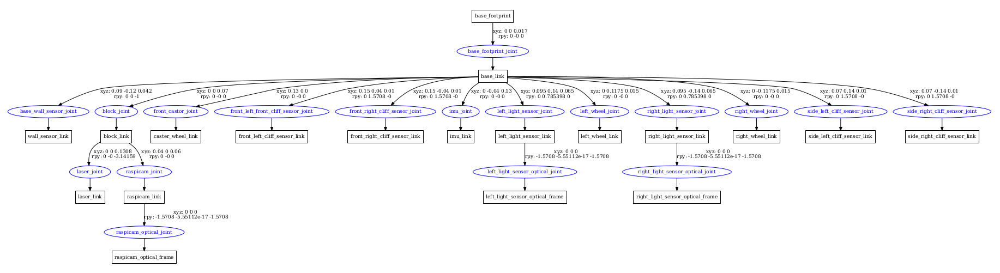

# Robot modeling

In this week we were assigned to investigate different subject regarding robot moldeing in ROS and Gazebo, and as a final assignment for this week we were asked to model two identical links that simulate light sensors.

## Xacro, URDF and SDF

These three XML representations are used for describing different aspects of 3D environments such as robots, sensors, objects, etc. The raison d'être of each one of them, beside the specification-differences and some limitations of some of them in relation to other ones, is the context in which each one is used.

`Xacro` is used for defining the final `URDF` file that will be used for describing the robot inside ROS. It's not convenient writing directly the `URDF` file because the `Xacro` files have tools that allow to write more modularized and reusable code, such as **macros** and file-including with invoking parameters, which allows us to avoid copy-pasting long blocks of code. So, if we want to describe a 3D model of a robot, the usual way is to write the `.xacro` file and then execute it with the corresponding `.launch` file, which in turn will execute a `.cpp` or `.py` file which will convert the `.xacro` file into a `.urdf` file.

`SDF` files have a lot more descriptive-power than `URDF` files. They can specify things that are not robots, such as lights, scenes, worlds, etc. Also, they can specify physical properties that a `URDF` cannot, such as friction, viscous damping coefficientes, and an initial pose for the robot.
Aside from all that, `SDF` files are the files used for creating 3D object and scenes inside the Gazebo simulator.

### Conversion between languages with terminal commands


#### Xacro to URDF

For this purpose, we can use the `xacro` command. The correct way of invoking this is `xacro file_to_convert.xacro > converted_file.urdf`. An example follows:

```console
create@galatea:/create_ws/src/create_autonomy/ca_description/urdf$ xacro create_2.xacro visualize:="true" > prueba.urdf 
xacro: Traditional processing is deprecated. Switch to --inorder processing!
To check for compatibility of your document, use option --check-order.
For more infos, see http://wiki.ros.org/xacro#Processing_Order
```

#### URDF to SDF

For this purpose, the `gz sdf` command can be used. The correct way of invoking this is `gz sdf -p file_to_convert.urdf > converted_file.sdf`. An example follows:

```console
gz sdf -p prueba.urdf > prueba.sdf
```


### check_urdf

This is an interesting tool for visualizing the links relations (parents and children). An example follows:

```console
create@galatea:/create_ws/src/create_autonomy/ca_description/urdf$ check_urdf prueba.urdf
robot name is: create_2
---------- Successfully Parsed XML ---------------
root Link: base_footprint has 1 child(ren)
    child(1):  base_link
        child(1):  wall_sensor_link
        child(2):  block_link
            child(1):  laser_link
            child(2):  raspicam_link
                child(1):  raspicam_optical_frame
        child(3):  caster_wheel_link
        child(4):  front_left_cliff_sensor_link
        child(5):  front_right_cliff_sensor_link
        child(6):  imu_link
        child(7):  left_light_sensor_link
            child(1):  left_light_sensor_optical_frame
        child(8):  left_wheel_link
        child(9):  right_light_sensor_link
            child(1):  right_light_sensor_optical_frame
        child(10):  right_wheel_link
        child(11):  side_left_cliff_sensor_link
        child(12):  side_right_cliff_sensor_link
create@galatea:/create_ws/src/create_autonomy/ca_description/urdf$
```

### urdf_to_graphiz

This is another tool which allows to visualize in an easy way the links relations, similar to the previous one but it creates a `.pdf` file which has the tree structure converted into image. The same tree that was shown before, now is showed as the output of the `urdf_to_graphiz` command:



It can be seen that additionally to the tree relation, the output shows the `xyz` and `rpy` vectors that corresponds to every joint in relation to its parent link.

## Simulating links as light sensors

<https://github.com/RoboticaUtnFrba/create_autonomy/pull/100>
