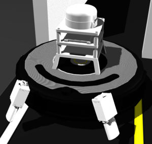
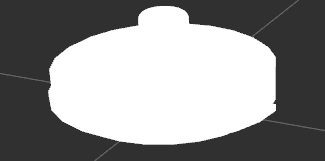
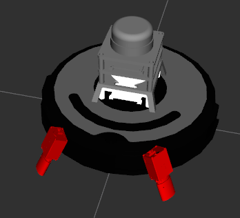

# Creating a sensor model with URDF and Xacro

We'll start by creating the visuals of the sensor.
Let's create a new `.xacro` file.

    roscd ca_description/urdf/sensors
    touch ramiro_color_sensor.xacro

Then we open the `ramiro_color_sensor.xacro` file with any editor we want.

We start a valid `xacro` with these first two lines of code:
```xml
<?xml version="1.0"?>
<robot xmlns:xacro="http://ros.org/wiki/xacro">
```

Then we include the files we need to our file

    <xacro:include filename="$(find ca_description)/urdf/sensors/laser_sensor_gazebo.xacro"/>
    <xacro:include filename="$(find ca_description)/urdf/common_properties.xacro"/>

And now we define a macro:

```xml
<xacro:macro name="color_sensor" params="prefix reflect parent visualize:=false">
<xacro:property name="parent_link" value="${parent}"/>
<xacro:property name="color_link" value="color_link"/>
<xacro:property name="x" value="0.0"/>
<xacro:property name="y" value="0.0"/>
...
```

We define some properties, they are sort of *variables*.

And then we define a *link* and a *joint*:
```xml
<link name="${prefix}_color_sensor">
     <visual>
    <geometry>
     <box size="${color_sensor_len} 0.02 0.02"/>
     </geometry>
    <origin xyz="0 0 -${color_sensor_len/2}"   rpy="0 ${0.7*(pi/2)} ${reflect}"/>
     <material name="white"/>
    </visual>
</link>
<joint name="base_to_${prefix}_color_sensor" type="fixed">
    <parent link="${parent_link}"/>
    <child link="${prefix}_color_sensor"/>
    <origin xyz="0.18 ${reflect*(.08)} 0.15"/>
</joint>
```

So let's stop here a bit.
In the `link` tag, we got the three `tags`, each one of them is optional.
So, in this case we are only using the `visual` tag; *Why?*
Well, the other ones are `inertia` and `collision`, but, the sensor, given its size and mass, won't contribute much on these.

Then we close the file with

    </xacro:macro>
    </robot>

Now, let's use the macro.
Go to the `create_base.xacro` file.

    roscd ca_description/urdf

First, include the file we just created, for us to be able to use the macro we just created.

    <xacro:include filename="$(find ca_description)/urdf/sensors/ramiro_color_sensor.xacro"/>

And then use it, 
```xml
<xacro:create_wheel prefix="left" y_offset="${wheel_separation / 2}" wheel_radius="${wheel_radius}" wheel_width="${wheel_width}"/>
<xacro:create_wheel prefix="right" y_offset="${wheel_separation / -2}" wheel_radius="${wheel_radius}" wheel_width="${wheel_width}"/>
<xacro:caster_wheel/>
<xacro:color_sensor parent="base_link" reflect="1" prefix="right"/>
<xacro:color_sensor parent="base_link" reflect="-1" prefix="left"/>
```

We can see in the last 2 lines of code, we called 2 times the macro we created.
They are both children of the `base_link`, we can set the `prefix` parameter to `customize` the name of the joints and links created by the macro.
And with the help of the `reflect` parameter, we can mirror the both visuals, obtaining both left and right sensors with the same script.

Now, let's check if it's working.

    roslaunch ca_gazebo create_autorace.launch

We can see the updated model in `gazebo`:



But in `rviz`, the model is a little buggy:



That's because the `fixed frame` is set to `/map`, a frame that is not defined in our case.
So set the `fixed frame` to `base_link` for example, and now it shows correctly:



## Manually converting from xacro --> URDF --> SDF

We can check this info in the `README.md` file inside the `ca_description` package.

Let's give it a try:

    roscd ca_description/urdf/
    roscore &
    rosrun xacro xacro --inorder create_2.xacro visualize:=false > test.urdf

We can check it created a `test.urdf` file.
To check whether the sintax is fine or has errors:

    check_urdf test.urdf


    robot name is: create_2
    ---------- Successfully Parsed XML ---------------
    root Link: base_footprint has 1 child(ren)
        child(1):  base_link
            child(1):  left_color_sensor
            child(2):  right_color_sensor
            child(3):  wall_sensor_link
            child(4):  block_link
                child(1):  laser_link
                child(2):  raspicam_link
                    child(1):  raspicam_optical_frame
            child(5):  caster_wheel_link
            child(6):  front_left_cliff_sensor_link
            child(7):  front_right_cliff_sensor_link
            child(8):  imu_link
            child(9):  left_wheel_link
            child(10):  right_wheel_link
            child(11):  side_left_cliff_sensor_link
            child(12):  side_right_cliff_sensor_link

And now we can manually convert to SDF.
To see how Gazebo will use the robot description:

    gz sdf -p test.urdf > test.sdf

You can open the `test.sdf` file with whatever editor you feel like, and check what's going to be used by gazebo.

## Adding optical frame

We need to create a link where our camera/sensor will be attached to.
In order to keep by the `rosREP` standard, we use the axis they suggest:

    Suffix Frames
    In the case of cameras, there is often a second frame defined with a "_optical" suffix. 
    This uses a slightly different convention:

    z forward
    x right
    y down

So, in our `ramiro_color_sensor.xacro`, we add:
```xml
<joint name="${prefix}_color_optical_joint" type="fixed">
  <origin xyz="0 0 0" rpy="${-pi/2} 0 ${-pi/2}" />
  <parent link="${prefix}_color_sensor" />
  <child link="${prefix}_color_optical_frame"/>
</joint>
<link name="${prefix}_color_optical_frame"/>
```
Now, `roslaunch ca_gazebo create_autorace.launch`:

And we can check in `rviz`, selecting the `tf's` we want to check, that the axis are correctly placed:

.

